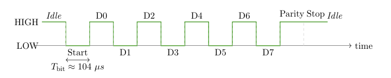
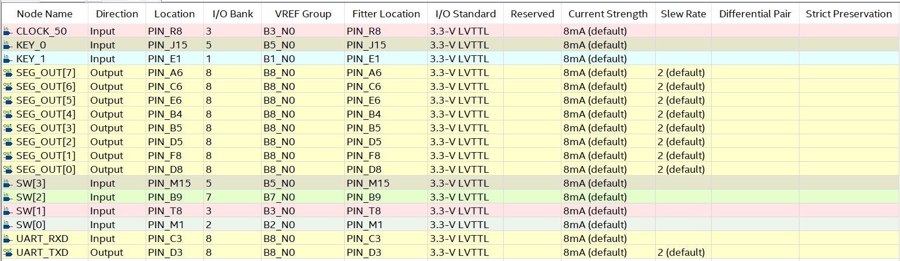
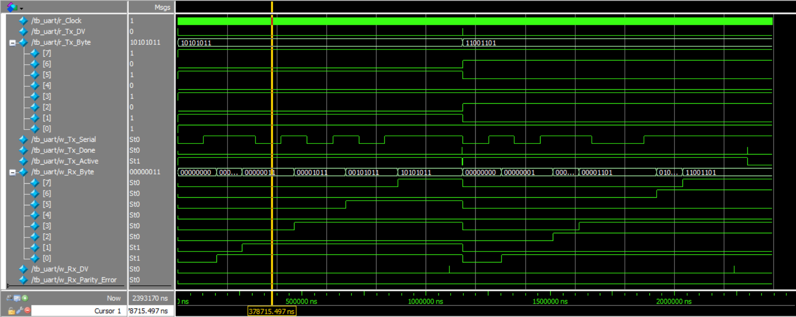
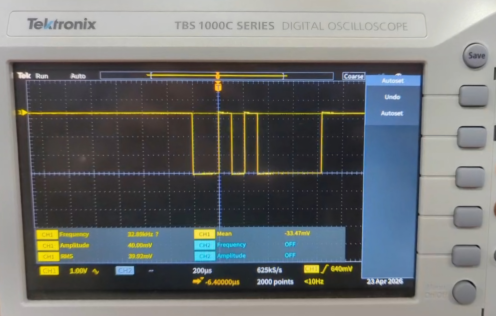

# UART Implementation on FPGA (DE0-Nano)

This repository contains the Verilog HDL implementation of a Universal Asynchronous Receiver/Transmitter (UART) system. The project was developed as part of the EN2111 Electronic Circuit Design module at the Department of Electronic and Telecommunication Engineering, University of Moratuwa.

## Overview

The system facilitates reliable serial data transfer at a baud rate of 9600 bps using the onboard 50 MHz clock of the DE0-Nano FPGA board. It includes both a transmitter and a receiver that communicate using a standard UART frame: one start bit, eight data bits, a parity bit for basic error detection, and a stop bit.

## Features
*   **Selectable Parity**: Supports both even and odd parity checking.
*   **Mid-Bit Sampling**: The receiver samples incoming data at the center of the bit period to maximize noise immunity and reject glitches.
*   **Debounced Input**: Implements a 3-bit shift register to debounce mechanical switch bouncing from the push button, generating a clean single-cycle pulse.
*   **Visual Error Detection**: Displays the reconstructed hexadecimal data on a 7-segment display; if a parity error occurs, only the decimal point is activated to flag invalid data.

## System Architecture

The architecture is divided into the following key Verilog modules:
*   **`uart_top_fpga.v`**: The top-level module that integrates all components and interfaces with the FPGA's physical pins.
*   **`uart_tx.v`**: A finite state machine (FSM) that computes parity and shifts out the UART frame bit-by-bit.
*   **`uart_rx.v`**: An FSM that detects the falling edge of the start bit and uses mid-bit sampling to read the incoming serial data.
*   **`hex_to_7_seg.v`**: A combinational lookup table that maps the 4-bit received hexadecimal value to a 7-segment encoding. 
*   **`button_pulse.v`**: Generates a single-cycle pulse from the transmission trigger button.

## Hardware & Pin Configuration

The design is mapped to the Altera DE0-Nano Cyclone IV FPGA board using the 3.3-V LVTTL I/O standard. 

*   **Inputs**: Uses 4 onboard DIP switches (`SW[3:0]`) to set the data, `KEY_0` to trigger transmission, and `KEY_1` as an active-low display reset.
*   **Outputs**: Received data is sent to an external 7-segment display driven by 8 GPIO pins.
*   **UART Lines**: `UART_TXD` and `UART_RXD` are mapped to designated GPIO pins.

## Simulation

The system's functional correctness was verified via a SystemVerilog testbench (`tb_uart.v`) using ModelSim. The transmitter and receiver were connected in a loopback configuration to validate proper frame generation, mid-bit sampling, and parity verification.

## Hardware Verification

Hardware testing was conducted successfully in two configurations:
1.  **Single-Board Loopback**: The `UART_TXD` and `UART_RXD` pins on a single DE0-Nano were connected via a jumper wire.
2.  **Inter-Board Communication**: Two DE0-Nano boards were connected (TX of one to RX of the other) with a common ground, successfully passing known data values between them.

Additionally, an oscilloscope was used to probe the TX line. The capture confirmed the idle HIGH state, the bit pattern, and the ~104.16 µs bit duration expected for a 9600 bps baud rate.

## How to Run
1. Clone this repository to your local machine.
2. Open the project in Intel Quartus Prime.
3. Compile the design and program it onto the DE0-Nano board.
4. Wire the 7-segment display according to the pin assignments.
5. Connect the `UART_TXD` pin to the `UART_RXD` pin for loopback testing.
6. Set a 4-bit hexadecimal value on the DIP switches and press `KEY_0` to transmit the frame.
